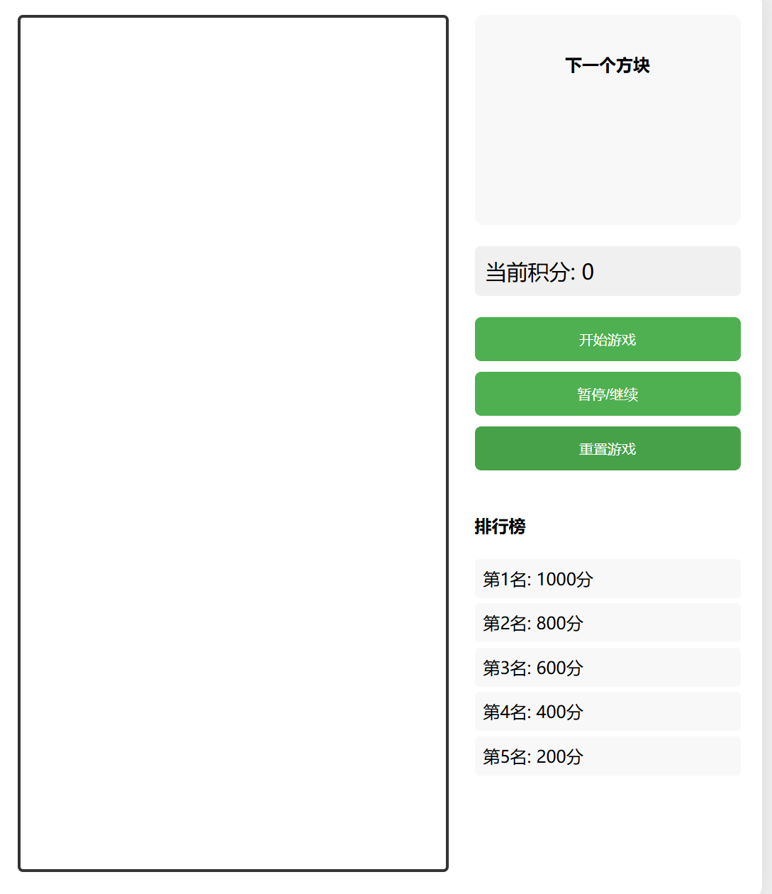

# 俄罗斯方块游戏



## 核心玩法
- 经典7种俄罗斯方块形状
- 支持键盘方向键旋转和移动
- 自动下落加速机制
- 行消除得分系统（单行/双行/三行/四行不同分数）

## 功能模块
- **积分系统**：实时积分统计与等级提升
- **排行榜系统**：使用localStorage保存前5名成绩
- **预览机制**：右侧面板显示下一个方块形状
- 暂停/继续功能

## 技术实现
- 基于HTML5 Canvas渲染游戏画面
- 使用ES6 Class封装游戏逻辑
- 响应式控制面板布局
- 键盘事件监听控制

## 运行说明
```bash
# 启动本地服务器
python -m http.server 8000
# 访问 http://localhost:8000/tetris.html
```

## 界面设计
- 左右分栏布局：左侧游戏区(400x800) + 右侧控制面板
- 自适应窗口居中显示
- 现代扁平化UI风格
- 按钮交互状态反馈

